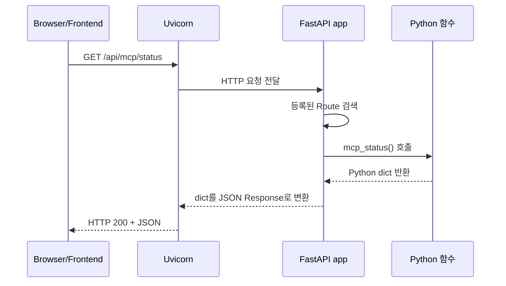
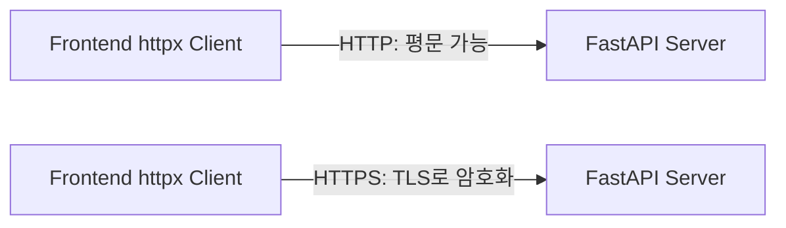
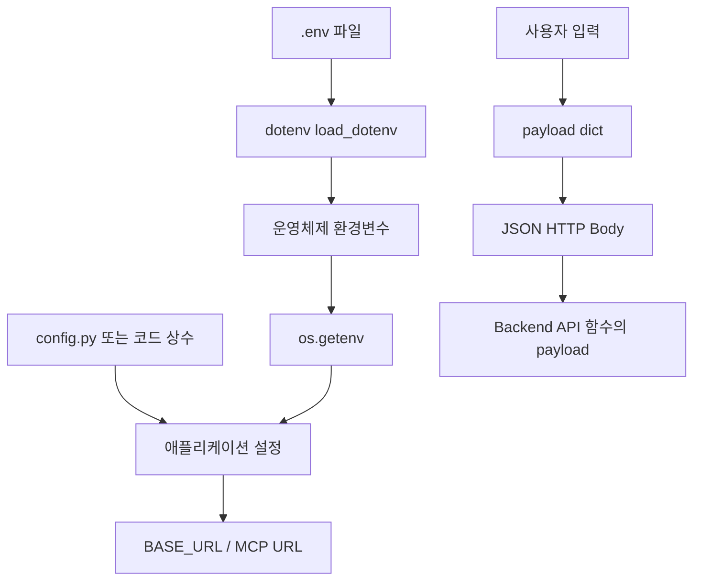
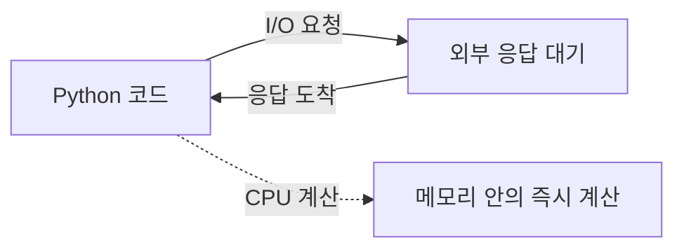
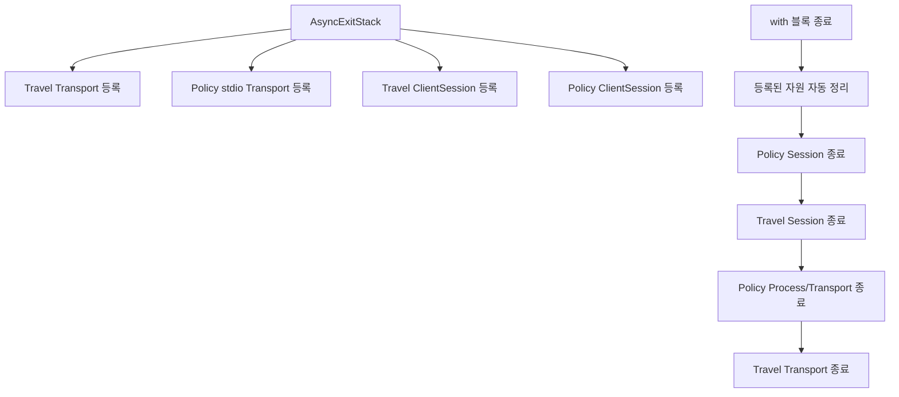
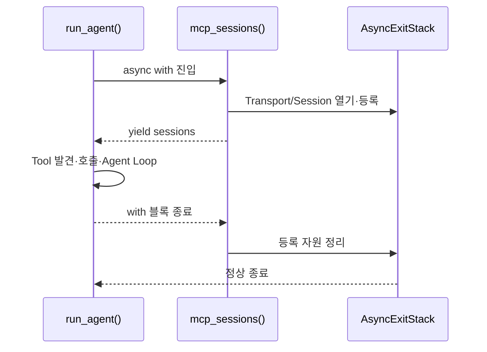
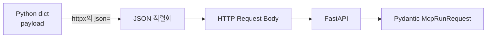

# Mini Agent 03 MCP · 완전 심화 개념 설명

이 문서는 코드를 눈으로 읽는 것에서 멈추지 않고, 실제로 소리 내어 설명한다고 가정한 발표용 심화 노트다.

읽는 순서는 다음을 권장한다.

```text
라이브러리
  → Frontend/Backend/Server 경계
  → HTTP와 TLS
  → 환경변수·config·payload
  → I/O와 비동기
  → as·stack·with·yield
  → hasattr
  → 실제 코드 한 줄 해석
```

---

## 1. 라이브러리란 무엇인가?

### 말로 설명하는 정의

**라이브러리는 다른 사람이 미리 만들어 둔 기능 묶음이다.**

우리가 매번 네트워크 연결, JSON 변환, 웹 서버, 화면 버튼을 처음부터 구현하지 않도록 재사용 가능한 코드를 가져다 쓴다.

```text
내 코드
  ↓ import
라이브러리가 제공하는 함수·클래스
  ↓ 호출
복잡한 내부 작업 수행
```

### 이 프로젝트의 라이브러리

| import | 역할 | 없으면 직접 만들어야 하는 것 |
| --- | --- | --- |
| `os` | 운영체제 정보·환경변수 읽기 | 프로세스 환경변수 접근 코드 |
| `httpx` | HTTP Client | TCP/TLS/HTTP 요청 처리 |
| `streamlit` | Python 기반 웹 UI | 브라우저 화면·이벤트 연결 |
| `fastapi` | HTTP API Server 프레임워크 | URL 라우팅·요청 파싱·응답 처리 |
| `pydantic` | 데이터 구조 검증 | 입력 타입·필수값·길이 검증 |
| `dotenv` | `.env` 파일 내용을 환경변수로 로드 | 파일 읽기·환경변수 등록 |
| `mcp` | MCP Client/Server 프로토콜 구현 | `initialize`, `tools/list`, `tools/call` 통신 |
| `openai` | OpenAI API Client | API HTTP 요청·응답 모델 처리 |

### 라이브러리와 프레임워크의 차이

```text
라이브러리: 내가 흐름을 주도하고 필요한 함수를 호출한다.
프레임워크: 프레임워크가 전체 흐름을 주도하고 내 함수를 특정 위치에서 호출한다.
```

`httpx.get()`은 라이브러리 사용 예다. 내가 원하는 순간에 호출한다.

`@app.post("/api/mcp/run")`은 FastAPI 프레임워크 사용 예다. 내가 URL과 함수를 등록하면, 나중에 HTTP 요청이 왔을 때 FastAPI가 해당 함수를 호출한다.

---

## 2. HTTP Server는 정확히 무엇인가?

### HTTP의 두 역할

HTTP는 프로그램 사이에서 요청과 응답을 주고받는 통신 규칙이다.

```text
Client                         Server
요청(Request)  ───────────────→
               ←────────────── 응답(Response)
```

HTTP Server는 특정 주소와 포트에서 요청을 기다리다가, 요청의 Method와 Path에 맞는 작업을 실행하고 응답을 보내는 프로그램이다.

### “어디부터 HTTP Server인가?”

다음 세 요소를 구분해야 한다.

```text
FastAPI app 객체
  = URL과 Python 함수를 연결해 둔 애플리케이션 설정

Uvicorn 프로세스
  = 실제 포트(8000)를 열고 HTTP 요청을 받아 FastAPI app에 전달하는 실행 서버

@app.get / @app.post
  = 어떤 HTTP 요청을 어떤 함수로 보낼지 등록하는 라우팅 규칙
```

따라서 이 코드만으로는 포트에서 기다리는 실행 서버가 아직 시작된 것이 아니다.

```python
app = FastAPI(...)
```

실제로 HTTP Server가 시작되는 것은 다음 실행 시점이다.

```powershell
uvicorn backend.app.main:app --reload --port 8000
```

여기서:

```text
uvicorn              = ASGI HTTP Server 실행 프로그램
backend.app.main     = import할 Python 모듈
:app                 = 그 모듈 안의 FastAPI 객체
--port 8000          = TCP 8000 포트에서 요청 대기
```

### FastAPI에서 실제 요청이 함수로 가는 과정



### `@app.post`는 왜 쓰는가?

```python
@app.post("/api/mcp/run", response_model=McpRunResult)
async def run_mcp_agent(payload: McpRunRequest):
    ...
```

이것은 `/post`라는 URL을 만드는 것이 아니다. 다음 두 조건을 동시에 등록한다.

```text
HTTP Method = POST
HTTP Path   = /api/mcp/run
실행 함수  = run_mcp_agent
```

POST는 질문처럼 서버에 처리할 데이터를 Body로 보내야 할 때 적합하다. GET은 URL을 통해 대상을 읽는 의미가 강하고, POST는 입력 Body를 이용해 작업을 요청하는 의미가 강하다.

---

## 3. `httpx`는 무엇이며 보안과 어떤 관계인가?

### 정확한 정의

**`httpx`는 Python에서 HTTP 요청을 보내는 Client 라이브러리다.**

```python
response = httpx.post(
    "http://127.0.0.1:8000/api/mcp/run",
    json={"question": "..."},
    timeout=60,
)
```

이 코드는 “8000 포트의 HTTP Server에 POST 요청을 보내고 응답을 기다리는” Client 동작이다.

### `httpx`는 Python에서만 쓰이는가?

`httpx`라는 이름의 구현체는 Python 라이브러리다. 그러나 HTTP Client라는 역할은 Python에만 있는 것이 아니다.

| 언어 | 비슷한 HTTP Client |
| --- | --- |
| Python | `httpx`, `requests`, `aiohttp` |
| JavaScript | `fetch`, `axios` |
| Java | `HttpClient`, OkHttp |
| C# | `HttpClient` |
| Go | `net/http` |

### `httpx`는 보안 도구인가?

아니다. `httpx`의 1차 역할은 통신이다.

```text
httpx = 요청을 만들고 보내고 응답을 받는 도구
HTTPS/TLS = 이동 중 데이터를 암호화하는 통신 보안 방식
인증/인가 = 누가 접근할 수 있는지 결정하는 보안 정책
```

`httpx`가 `https://` URL에 연결하면 TLS를 사용하는 HTTPS 통신을 할 수 있다. 하지만 다음은 별도의 문제다.

- API Key를 코드에 하드코딩하지 않는가?
- 서버 인증서를 검증하는가?
- 사용자가 이 API를 호출할 권한이 있는가?
- 요청 입력을 검증하는가?
- 로그에 비밀번호나 토큰을 남기지 않는가?

### HTTP와 HTTPS 비교



현재 학습 프로젝트의 `127.0.0.1` 통신은 로컬 개발이라 `http://`를 사용한다. 운영 환경에서 외부 네트워크를 통과한다면 HTTPS와 인증을 함께 고려해야 한다.

---

## 4. OS, 환경변수, `.env`, config, payload의 차이

이 다섯 개는 모두 “설정값이나 데이터”처럼 보이지만 저장 위치와 목적이 다르다.

### 4-1. OS와 `os`

OS는 Windows, Linux, macOS 같은 운영체제다. 운영체제는 실행 중인 프로세스에게 환경변수라는 key/value 저장 공간을 제공한다.

```text
운영체제
  └─ 현재 프로세스의 환경변수
       ├─ BACKEND_API_URL=http://127.0.0.1:8000
       ├─ OPENAI_API_KEY=...
       └─ MCP_PORT=8010
```

`os`는 Python에 기본으로 포함된 표준 라이브러리 모듈이다.

```python
os.getenv("BACKEND_API_URL", "http://127.0.0.1:8000")
```

뜻은 다음과 같다.

```text
운영체제 환경변수에서 BACKEND_API_URL을 찾아라.
있으면 그 값을 사용하라.
없으면 기본값 http://127.0.0.1:8000을 사용하라.
```

`os`는 설정 파일도 아니고, 요청 데이터도 아니다. 운영체제와 Python 프로그램 사이의 접근 도구다.

### 4-2. `.env`와 `dotenv`

`.env`는 환경변수를 파일에 적어 두는 개발 편의 파일이다.

```env
OPENAI_API_KEY=비밀값
OPENAI_MODEL=gpt-4.1-mini
```

`dotenv`는 이 파일을 읽고 현재 Python 프로세스 환경변수처럼 등록하는 라이브러리다.

```python
load_dotenv(PROJECT_ROOT / ".env")
```

그 후에는 다음이 가능하다.

```python
os.getenv("OPENAI_API_KEY")
```

즉 `dotenv`와 `os`는 경쟁 관계가 아니다.


### 4-3. config.py와의 차이

이 `03 mcp`에는 별도 `config.py`가 없고, `MCP_SERVERS` 같은 설정을 Python 코드 안에 두었다. 일반적으로 `config.py`는 애플리케이션 설정을 한 곳에 모으는 Python 파일이다.

```python
# config.py의 예
BACKEND_API_URL = "http://127.0.0.1:8000"
MCP_PORT = 8010
```

차이는 다음과 같다.

| 구분 | `os.getenv` | `.env` + `dotenv` | `config.py` | `payload` |
| --- | --- | --- | --- | --- |
| 정체 | OS 값 읽기 API | 설정 파일 + 로더 | 앱 설정 모듈 | 요청에 실어 보내는 데이터 |
| 시점 | 실행 중 읽음 | 시작 시 프로세스에 로드 | import 시 읽음 | 요청마다 생성 |
| 목적 | 환경별 값 분리 | 비밀값·로컬 설정 관리 | 기본 설정·구조화된 상수 | 함수/API 입력 전달 |
| 예시 | `os.getenv("MCP_PORT")` | `.env`의 `OPENAI_MODEL` | `MAX_ROUNDS = 8` | `{"question": "..."}` |
| 이동 경로 | OS → 코드 | 파일 → OS형 환경변수 → 코드 | 파일 → import → 코드 | Frontend → HTTP Body → Backend |

### 4-4. payload는 설정값이 아니다

`payload`는 “이번 요청에만 필요한 데이터 묶음”이다.

```python
post("/api/mcp/run", {"question": question})
```

여기서:

```text
BASE_URL = 어디로 보낼지 결정하는 설정
path     = 어떤 API 기능을 부를지 결정하는 주소
payload  = 이번 호출에서 무엇을 처리할지 담은 데이터
```

### 전체 비교 그림



---

## 5. I/O 함수란 무엇인가?

### 정의

I/O는 Input/Output의 약자다.

```text
Input  = 프로그램 밖에서 데이터를 받아오기
Output = 프로그램 밖으로 데이터를 내보내기
```

### I/O 예시

| 코드 | I/O 대상 |
| --- | --- |
| `httpx.post(...)` | 네트워크로 요청을 내보내고 응답을 받음 |
| `client.responses.create(...)` | OpenAI API와 네트워크 통신 |
| `session.call_tool(...)` | MCP Server 프로세스/네트워크와 통신 |
| `stdio_client(...)` | 자식 프로세스 stdin/stdout |
| `load_dotenv(...)` | 파일을 읽음 |
| `print(...)` | 터미널로 출력 |

CPU가 메모리 안의 계산을 하는 동안 I/O는 외부 장치나 다른 프로세스를 기다린다. 네트워크 응답은 언제 도착할지 알 수 없으므로 I/O는 대기 시간이 생긴다.



### 왜 I/O 함수에 `async`와 `await`를 쓰는가?

동기 방식은 다음과 같다.

```text
요청 1 보내기 → 응답 올 때까지 정지 → 다음 작업
```

비동기 방식은 대기 중 이벤트 루프가 다른 작업을 처리할 기회를 얻는다.

```text
요청 1 보내기 → 기다리는 동안 다른 작업 → 응답 도착 시 계속
```

`async`는 “이 함수 안에 비동기 대기가 있을 수 있다”고 선언하고, `await`는 “이 작업 결과가 필요하니 여기서 기다리되 이벤트 루프에는 제어권을 양보한다”고 표현한다.

```python
response = await client.responses.create(...)
```

`await`는 일반 계산 함수에 붙이는 것이 아니라, awaitable을 반환하는 비동기 I/O 작업에 사용한다.

---

## 6. `as`는 어떤 역할인가?

`as`는 한 가지 고정 의미가 아니라 문맥에 따라 “이 대상을 이 이름으로 부르겠다”는 연결 문법이다.

### 6-1. import 별칭

```python
import streamlit as st
```

```text
긴 이름 streamlit을 이후 코드에서 짧은 이름 st로 사용
st.title(...) == streamlit.title(...)
```

### 6-2. with 결과에 이름 붙이기

```python
async with mcp_sessions() as sessions:
```

`mcp_sessions()`가 `yield`한 값을 `sessions`라는 지역 변수에 받는다.

```text
context manager 진입
  → yield sessions
  → as sessions에 값 연결
  → 블록 안에서 sessions 사용
```

### 6-3. 예외 객체에 이름 붙이기

```python
except HTTPException as error:
```

발생한 예외 객체를 `error`라는 이름으로 받아 메시지나 상태를 읽는다.

### 6-4. 예외 원인 연결의 `from`

```python
raise HTTPException(...) from error
```

이것은 `as`는 아니지만 자주 함께 읽는 문법이다. 원래 `error`가 어떤 원인으로 HTTPException으로 바뀌었는지 Python traceback에 연결한다.

---

## 7. `stack`은 무엇인가?

### 이 코드에서의 stack

```python
async def open_session(stack: AsyncExitStack, config: dict[str, Any]):
```

`stack`은 일반적인 자료구조 이름처럼 보이지만, 여기서는 `AsyncExitStack` 객체를 담은 변수명이다.

이 객체의 역할은 **여러 개의 비동기 자원을 등록해 두고, 작업이 끝나면 등록 역순으로 정리하는 것**이다.

### 왜 필요한가?

이 프로젝트는 한 번에 여러 연결을 연다.

```text
Travel HTTP 연결
Policy 자식 프로세스 연결
Travel ClientSession
Policy ClientSession
```

중간에 오류가 나도 일부 연결만 남으면 자원 누수, 좀비 프로세스, 포트 점유가 생길 수 있다.



### 비유

```text
stack = 빌린 자원을 기록하는 체크리스트
enter_async_context = 자원을 빌리고 체크리스트에 등록
블록 종료 = 체크리스트를 거꾸로 확인하며 반납
```

---

## 8. `with`, `async with`, `yield`의 관계

### `with`

`with`는 자원 준비와 정리를 한 쌍으로 묶는 문법이다.

```python
with open("file.txt") as file:
    content = file.read()
```

파일을 열고, 블록을 실행하고, 예외가 나도 파일을 닫는다.

### `async with`

비동기 버전이다.

```python
async with AsyncOpenAI() as client, mcp_sessions() as sessions:
    ...
```

여기에는 두 개의 비동기 context manager가 있다.

```text
AsyncOpenAI()  → client라는 이름으로 연결 자원 사용
mcp_sessions() → sessions라는 이름으로 MCP Session 사용
```

네트워크 연결이나 자식 프로세스처럼 열고 닫는 과정 자체가 비동기일 수 있을 때 쓴다.

### `yield`

`yield`는 값을 한 번 내보내고 함수의 현재 상태를 잠시 멈추는 문법이다. 일반 `return`과 달리, context manager가 블록 종료 시 뒤쪽 정리 코드로 돌아올 수 있게 한다.

```python
@asynccontextmanager
async def mcp_sessions():
    async with AsyncExitStack() as stack:
        sessions = {}
        ...
        yield sessions
```

개념적으로 다음과 같다.

```text
async with mcp_sessions() as sessions:
    # yield 앞부분: Session 준비
    # yield sessions: 호출자에게 사용권 전달
    # 블록 실행
    # yield 이후: 정리 단계로 복귀
```

`@asynccontextmanager`가 없으면 `yield`가 있는 async generator를 직접 관리해야 한다. 데코레이터가 “yield 전 = 진입, yield 후 = 종료” 구조를 `async with`로 사용할 수 있게 바꿔 준다.

### 전체 생명주기



---

## 9. `hasattr`는 무엇인가?

### 정의

`hasattr(object, "name")`은 객체에 특정 속성(attribute)이 있는지 확인해 `True` 또는 `False`를 반환한다.

```python
hasattr(content, "text")
```

뜻은:

```text
content 객체에서 text라는 속성을 읽을 수 있는가?
```

### 왜 이 프로젝트에서 필요한가?

MCP 결과의 `content`에는 텍스트 외에 이미지, 리소스 등 다른 종류의 content가 들어올 가능성이 있다. 모든 content가 `.text`를 가진다고 가정하면 AttributeError가 날 수 있다.

```python
return "\n".join(
    content.text
    for content in result.content
    if hasattr(content, "text")
)
```

이 코드는 다음 단계다.

```text
result.content를 하나씩 본다.
  → text 속성이 있는 조각만 통과시킨다.
  → content.text를 꺼낸다.
  → 줄바꿈으로 합친다.
```

### 직접 만든 예시

```python
class TextPart:
    text = "날씨는 맑음"

class ImagePart:
    image_url = "https://example.com/weather.png"

parts = [TextPart(), ImagePart()]

for part in parts:
    if hasattr(part, "text"):
        print(part.text)
```

출력:

```text
날씨는 맑음
```

`ImagePart`에는 text가 없으므로 건너뛴다.

### `hasattr`와 `dict`의 차이

```python
hasattr(obj, "text")  # 객체의 속성 확인
"text" in data        # dict의 키 확인
```

MCP SDK 결과는 객체이므로 `hasattr`를 사용한다. JSON을 `dict`로 받은 경우에는 `"text" in data`가 더 알맞다.

---

## 10. 실제 코드 한 줄을 구조적으로 읽기

```python
response = httpx.post(
    f"{BASE_URL}{path}",
    json=payload,
    timeout=60,
)
```

이 한 덩어리를 수학식처럼 분해하면 다음과 같다.

```text
response
  = httpx.post(
      URL,
      JSON_BODY,
      TIMEOUT
    )
```

### 왼쪽 `response =`

함수 호출이 반환한 결과 객체를 `response`라는 이름에 할당한다. 이 객체에는 상태 코드, 헤더, 응답 본문을 읽는 기능이 있다.

### `httpx.post`

```text
httpx = import한 모듈 이름
.      = 모듈 안의 post 속성/함수에 접근
post   = HTTP POST 요청을 만드는 함수
```

### `f"{BASE_URL}{path}"`

두 문자열을 붙여 최종 URL을 만든다.

```text
BASE_URL = http://127.0.0.1:8000
path     = /api/mcp/run
결과     = http://127.0.0.1:8000/api/mcp/run
```

### `json=payload`

`post()` 함수의 이름 있는 인자(keyword argument)다. `payload` dict를 JSON Body로 직렬화해서 보낸다.

```text
Python dict
  → JSON 직렬화
  → HTTP Request Body
  → FastAPI가 McpRunRequest로 검증
```

### `timeout=60`

서버가 60초 동안 응답하지 않으면 무한히 기다리지 않고 Timeout 예외를 발생시킨다. 외부 네트워크를 기다리는 프로그램에는 종료 기준이 필요하다.

---

## 11. 발표자가 최종적으로 말할 수 있어야 하는 흐름

```text
Frontend의 httpx는 HTTP Client다.
보안 자체를 담당하는 것이 아니라 HTTP 요청을 전송한다.

@app.post는 /api/mcp/run이라는 POST Route를 FastAPI 함수에 등록한다.
Uvicorn이 8000 포트를 열고 실제 HTTP Server 역할을 한다.

payload는 이번 요청의 데이터이고, json=payload는 그것을 JSON Body로 보낸다.
Backend의 Pydantic 모델이 그 JSON을 McpRunRequest 객체로 검증한다.

run_mcp_agent()는 await run_agent()를 호출한다.
await는 OpenAI/MCP 같은 I/O가 끝날 때까지 비동기 방식으로 기다린다.

mcp_sessions()는 asynccontextmanager다.
yield 앞에서 Session을 열고, yield로 sessions를 전달하고,
블록이 끝나면 AsyncExitStack이 연결과 자식 프로세스를 정리한다.

hasattr는 MCP 결과 조각에 text가 있는지 확인한다.
text가 있는 조각만 꺼내 최종 문자열로 합친다.
```

---

## 12. 한 장 비교 도식

```mermaid
flowchart TD
    FE[Streamlit Frontend\nst.button / post] -->|httpx POST + JSON payload| API[Uvicorn + FastAPI HTTP Server\n@app.post route]
    API -->|Pydantic 검증| FUNC[run_mcp_agent(payload)]
    FUNC -->|await: I/O 대기| AGENT[run_agent(question)]
    AGENT -->|async with| SESSION[mcp_sessions()]
    SESSION -->|yield sessions| LOOP[Agent Loop]
    LOOP -->|tools/list / tools/call| MCP[MCP Server]
    MCP -->|content 조각| TEXT[hasattr(content, "text")]
    TEXT -->|텍스트만 합치기| RESULT[McpRunResult]
    RESULT --> FE
    ENV[.env] -->|dotenv| PROC[프로세스 환경변수]
    PROC -->|os.getenv| CONF[URL·API Key·Port 설정]
    CONF --> API
```

---

## 13. `def post(path: str, payload: dict) -> dict` 완전 해부

이 선언은 `post`라는 이름 때문에 무언가를 “등록(register)”하는 것처럼 보일 수 있다. 여기서는 두 가지 `post`를 구분해야 한다.

```text
HTTP POST       = HTTP 통신 규칙의 이름
def post(...)   = 그 HTTP POST를 편하게 호출하기 위해 만든 Python 함수 이름
```

Python 함수 이름은 개발자가 정한다. 이 코드의 `post`는 Python 예약어도 아니고, 자동으로 Backend에 등록하는 명령도 아니다. `httpx.post()`를 매번 길게 쓰지 않도록 감싼 wrapper 함수다.

```python
def post(path: str, payload: dict) -> dict:
    response = httpx.post(f"{BASE_URL}{path}", json=payload, timeout=60)
    response.raise_for_status()
    return response.json()
```

이를 입력과 출력으로 표현하면 다음과 같다.

```text
post(path, payload) → dict

입력 1: path 문자열
입력 2: payload dict
출력  : Backend 응답을 변환한 dict
```

### `def`는 무엇을 만드는가?

```python
def post(...):
    ...
```

이 줄은 즉시 HTTP 요청을 보내지 않는다. `post`라는 이름 아래에 “나중에 호출할 실행 절차”를 저장한다.

```text
함수 정의(def)       = 실행 절차를 등록
함수 호출(post(...))  = 그 절차를 실제 실행
```

파일이 처음 실행될 때는 함수만 만들어 둔다. 사용자가 버튼을 누르고 `post(...)`가 실행되는 순간에 네트워크 요청이 발생한다.

### `path`는 왜 받는가?

`path`는 Backend 안에서 어떤 기능을 요청할지 나타내는 URL 뒤쪽 경로다.

```python
BASE_URL = "http://127.0.0.1:8000"
path = "/api/mcp/run"
```

```text
BASE_URL + path
http://127.0.0.1:8000 + /api/mcp/run
→ http://127.0.0.1:8000/api/mcp/run
```

`path`를 인자로 따로 받는 이유는 같은 `post()` 함수를 여러 API에 재사용하기 위해서다.

```python
post("/api/mcp/run", ...)
post("/api/another-action", ...)
```

같은 POST 방식을 사용해도 서로 다른 Backend Route를 호출할 수 있다.

### `path: str`에서 `str`는 무슨 의미인가?

```python
path: str
```

다음처럼 읽는다.

> `path`라는 입력값은 문자열 형태로 전달될 예정이다.

URL 경로는 글자들의 조합이므로 문자열이 자연스럽다. `str`은 타입 힌트이며, URL 연결이나 네트워크 통신을 실행하는 명령이 아니다.

```python
path = "/api/mcp/run"       # 자연스러운 입력
path = 123                   # URL 경로로는 부적절한 입력
```

타입 힌트는 사람·IDE·정적 검사기를 위한 계약이다. Python이 기본적으로 실행 중 모든 타입을 강제하는 장치는 아니다.

### `payload`는 무엇인가?

`payload`는 **이번 요청에 실어 보내는 데이터 묶음**이다.

```text
주소        = BASE_URL + path
우편 내용   = payload
전달 방법   = HTTP POST
```

현재 프로젝트에서는 Agent에 전달할 질문을 payload에 담는다.

```python
result = post(
    "/api/mcp/run",
    {"question": question},
)
```

호출하는 쪽의 두 번째 값이 함수 내부의 `payload`로 전달된다.

```text
{"question": question}
        ↓ 전달
payload
```

`payload`는 고정된 전역 데이터가 아니다. 호출할 때마다 새로 전달되는 지역 입력값이다.

```python
post("/api/mcp/run", {"question": "부산 호텔을 찾아 주세요."})
post("/api/mcp/run", {"question": "서울 날씨를 알려 주세요."})
```

같은 함수와 path라도 호출마다 다른 payload를 넣을 수 있다. 함수가 재사용 가능한 이유가 입력을 매개변수로 받기 때문이다.

### `payload: dict`에서 `dict`는 무슨 의미인가?

```python
payload: dict
```

`payload`가 key/value 쌍으로 이루어진 Python dictionary라는 타입 힌트다.

```python
{
    "question": "부산 호텔을 찾아 주세요."
}
```

```text
"question" = key, 값의 의미를 나타내는 이름
문자열      = value, 실제 전달할 질문
```

문자열만 보내는 것보다 dict가 데이터 의미를 보존하기 쉽다.

```text
문자열만 전송: "부산 호텔을 찾아 주세요."
dict 전송   : {"question": "부산 호텔을 찾아 주세요."}
```

Backend는 `question`이라는 key를 보고 이 값이 질문이라는 것을 알 수 있다. 다만 현재 `McpRunRequest` Schema는 `question`만 정의하므로 이 프로젝트의 실제 payload도 질문 하나만 보낸다.

### `-> dict`는 무엇을 의미하는가?

```python
def post(path: str, payload: dict) -> dict:
```

마지막 `-> dict`는 함수가 끝났을 때 호출자에게 dict를 돌려줄 예정이라는 반환 타입 힌트다.

```python
return response.json()
```

`response.json()`은 서버 응답 JSON을 Python dict/list 등의 값으로 바꾼다. 따라서 호출자는 다음처럼 결과를 읽을 수 있다.

```python
result = post(...)
result["answer"]
result["trace"]
```

함수 내부의 `payload`와 함수 밖의 `result`는 방향이 반대다.

```text
payload = Frontend → Backend로 보내는 입력
result  = Backend → Frontend로 돌아오는 출력
```

### `json=payload`는 정확히 어떤 변환인가?

```python
httpx.post(url, json=payload)
```

뜻은 “payload dict를 JSON으로 직렬화해 HTTP Request Body에 넣어 보내라”이다.



```text
Python 메모리 안
{"question": "부산 호텔을 찾아 주세요."}
        ↓ JSON 직렬화
네트워크 Request Body
{"question":"부산 호텔을 찾아 주세요."}
        ↓ FastAPI/Pydantic 파싱
payload.question == "부산 호텔을 찾아 주세요."
```

JSON은 서로 다른 프로세스와 언어가 공통으로 이해할 수 있고, key/value·배열·문자열·숫자·참/거짓을 구조적으로 표현할 수 있기 때문에 API Body에 자주 사용한다.

### `json=payload`와 `data=payload`는 같은가?

같지 않다.

```python
httpx.post(url, json=payload)
```

JSON API를 호출할 때 쓴다. `httpx`가 JSON 직렬화와 `Content-Type: application/json` 처리를 도와준다.

```python
httpx.post(url, data=payload)
```

form 데이터나 다른 Body 형식에 사용한다. Backend가 JSON을 기대하는데 `data=`로 보내면 요청 계약이 맞지 않을 수 있다.

### GET과 POST 호출 비교

Frontend에는 다음 두 종류가 있다.

```python
get("/api/mcp/tools")
post("/api/mcp/run", {"question": question})
```

```text
get(path)
  입력: 주소
  목적: 상태·목록·Resource 읽기
  Body: 보통 없음

post(path, payload)
  입력: 주소 + 처리할 데이터
  목적: 질문을 보내 Agent 실행 요청
  Body: JSON payload
```

Backend Route와 연결하면 다음과 같다.

```text
Frontend get("/api/mcp/tools")
  → @app.get("/api/mcp/tools")
  → list_mcp_tools()

Frontend post("/api/mcp/run", {"question": ...})
  → @app.post("/api/mcp/run")
  → run_mcp_agent(payload)
```

### 최종 말하기 연습

> `post`는 등록이라는 뜻으로 고정된 Python 명령이 아니라, 이 프로젝트에서 HTTP POST를 보내도록 만든 함수 이름입니다. `path`는 Backend의 어느 Route로 갈지 나타내는 문자열이고, `payload`는 이번 요청에서 처리할 입력 데이터를 담은 dict입니다. `json=payload`는 그 dict를 JSON으로 직렬화해 HTTP Body에 넣는다는 뜻입니다. 함수 호출마다 payload가 달라질 수 있는 이유는 payload가 고정 설정이 아니라 호출 시 전달되는 매개변수이기 때문입니다. `-> dict`는 HTTP 응답을 JSON에서 Python dict로 바꿔 반환한다는 함수 반환 타입 힌트입니다.

## 함수 안의 변수 연결을 읽는 법

공통 개념을 사전처럼 외우기보다, 한 함수 안에서 값이 어떻게 변해 다음 함수로 이동하는지 읽어야 합니다. 아래는 이 저장소의 실제 구조를 하나의 실행 장면으로 단순화한 것입니다.

```text
사용자 질문(str)
   │
   ▼
agent.run(question)
   │  input_items = question
   ▼
OpenAI responses.create(...)
   │
   ├─ response.output 안에 function_call 있음
   │       │
   │       ├─ call.name = 공개 Tool 이름
   │       ├─ call.arguments = JSON 문자열
   │       ├─ json.loads(...) = Python dict arguments
   │       └─ MCP session.call_tool(실제 이름, arguments)
   │                         │
   │                         ▼
   │                    Tool 실행 결과
   │
   └─ function_call 없음
           │
           └─ response.output_text = 사용자에게 보낼 최종 자연어
```

### `ProviderResult`가 필요한 이유

OpenAI는 `response.output_text`, Gemini는 `response.text`, Ollama는 `response.json()["message"]["content"]`처럼 응답을 꺼내는 방법이 서로 다릅니다. 이 차이를 라우터까지 노출하면 라우터가 Provider마다 `if`를 반복해야 합니다.

그래서 각 Provider 함수가 자기 SDK 응답을 다음 공통 상자로 번역합니다.

```python
ProviderResult(
    provider="openai",       # 실제 선택된 공급자
    model="사용한 모델명",      # 재현·표시·평가에 필요한 정보
    content=response.output_text,  # 서비스가 실제로 사용할 답변
    latency_ms=round(...),     # 성능 측정값
)
```

이것은 단순한 dict보다 필드 계약을 분명히 하는 `dataclass`입니다. `generation_service`나 API 라우터는 `result.content`만 사용하고, OpenAI의 원본 response 객체를 직접 알 필요가 없습니다. 즉 `ProviderResult`는 “외부 SDK 세계 → 우리 애플리케이션 세계”의 변환 경계입니다.

### `response.output_text`와 `response.output`의 차이

`response`는 문자열이 아니라 id와 출력 목록 등을 가진 응답 객체입니다. `response.output`은 텍스트, 함수 호출 같은 항목들의 목록이므로 Agent는 다음처럼 함수 호출만 찾아야 합니다.

```python
tool_calls = [item for item in response.output
              if item.type == "function_call"]
```

반대로 Tool 호출이 없으면 이번 응답은 사용자에게 말할 차례입니다. 이때 `response.output_text`를 쓰면 출력 목록을 직접 순회하거나 항목별 타입을 다시 해석하지 않고 최종 텍스트만 얻습니다. 따라서 `output_text`는 “모든 응답 데이터”가 아니라 “최종 답변 칸”입니다.

### `round_number`, `round(...)`, `previous_response_id`는 서로 다르다

이름이 비슷하지만 역할이 다릅니다.

| 표현 | 위치 | 의미 |
|---|---|---|
| `round_number` | Agent Loop | LLM 판단 → Tool 실행 → 결과 전달 한 사이클의 순번. `trace`에서 실행 순서를 보여준다. |
| `round(value)` | 시간 계산 | 소수점이 있는 지연시간을 반올림한다. `round((now-start)*1000)`은 초를 ms 정수로 바꾼다. |
| `previous_response_id` | 다음 LLM 요청 | 직전 LLM 응답과 다음 요청을 연결하는 식별자. Tool 결과가 어느 판단에 대한 것인지 이어 준다. |

`range(1, MAX_AGENT_ROUNDS + 1)`의 `+1`은 Python `range`가 끝값을 포함하지 않기 때문에 최대 횟수를 실제로 포함시키는 장치입니다. 반복 횟수 제한은 Tool이 계속 호출되는 무한 루프를 막습니다.

### `payload`가 호출마다 달라지는 이유

`payload`는 설정 파일의 고정값이 아니라 함수가 호출될 때 만들어지는 지역 입력값입니다.

```python
def post(path: str, payload: dict) -> dict:
    response = httpx.post(f"{BASE_URL}{path}", json=payload)
    return response.json()

post("/api/mcp/run", {"question": "서울 호텔을 찾아줘"})
post("/api/mcp/run", {"question": "부산 날씨를 알려줘"})
```

두 호출은 같은 함수 코드를 재사용하지만, 호출자가 다른 dict를 넣으므로 HTTP Body가 달라집니다. `path`는 “어느 Backend 함수로 보낼지”, `payload`는 “그 함수가 이번에 처리할 재료가 무엇인지”를 분리합니다. `json=payload`는 Python dict를 네트워크에서 통용되는 JSON 문자열/바이트 형식으로 직렬화해 Body에 넣으라는 httpx의 명시적 옵션입니다. httpx가 보안을 제공하는 것이 아니라 HTTP 통신을 제공하며, 암호화는 URL이 `https://`일 때 TLS 계층이 담당합니다.

### 발표용 한 문장

“이 프로젝트의 핵심은 각 계층이 자기 역할의 자료형으로 값을 넘기는 것입니다. 프론트는 `payload`를 JSON Body로 보내고, Backend는 이를 입력 모델로 검증한 뒤 Agent에 전달합니다. Agent는 `response.output`에서 Tool 호출 여부를 판단하고, Tool 결과를 `function_call_output`으로 다시 LLM에 연결합니다. Provider는 서로 다른 SDK 응답을 `ProviderResult`로 통일하고, 최종 자연어가 필요할 때만 `response.output_text`를 꺼냅니다.”
