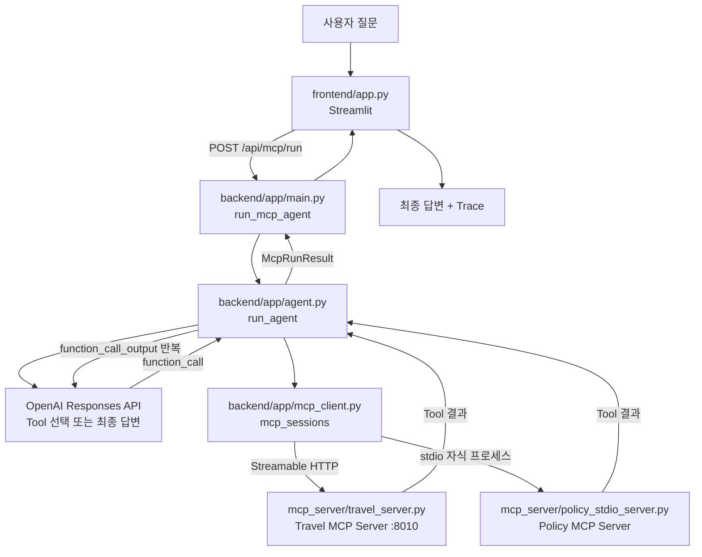
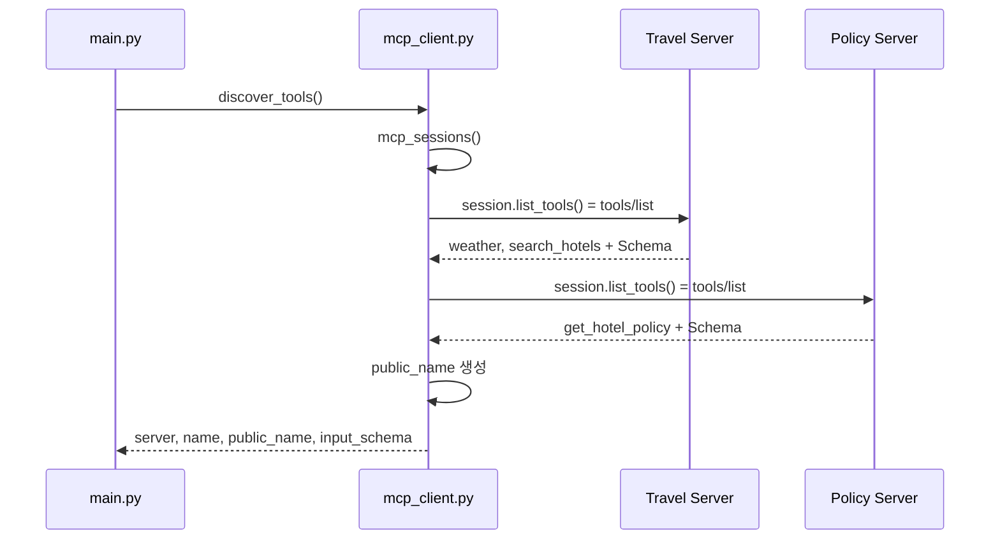
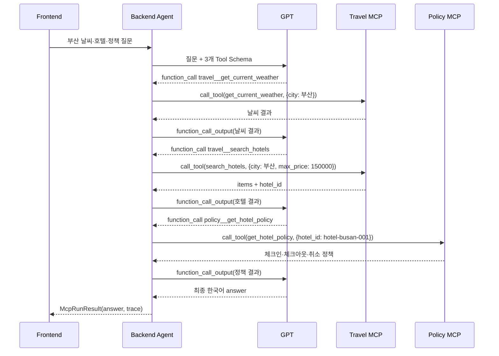
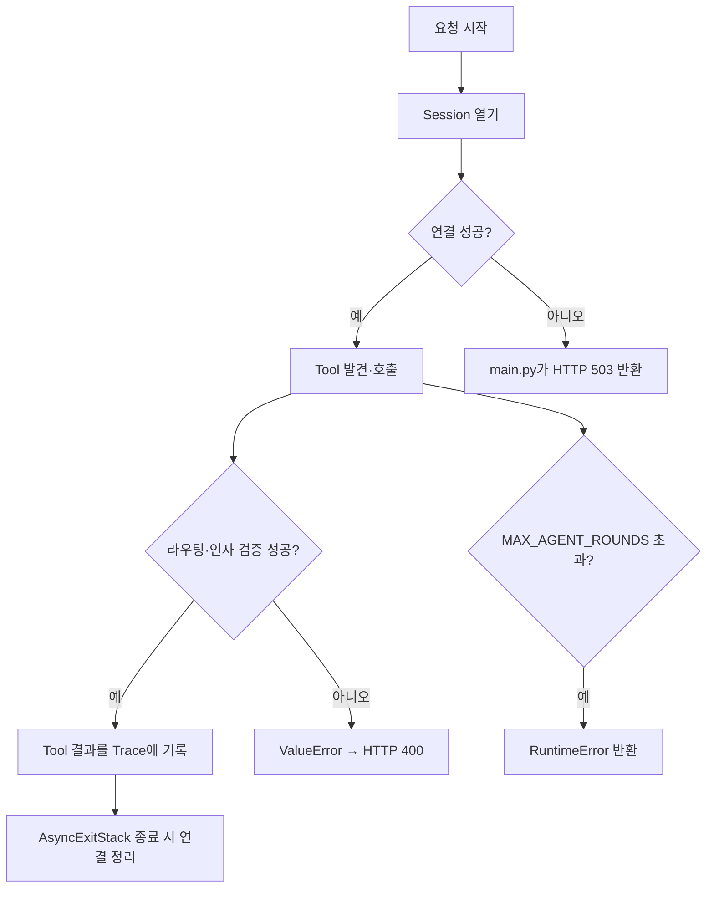

# Mini Agent 03 · 함수 흐름도

이 문서는 `mini_agent_03_mcp`의 기존 코드를 수정하지 않고, 각 함수가 어디에서 호출되어 어디로 이어지는지 그린 학습용 지도다.

## 1. 전체 시스템 흐름



## 2. Agent Loop 상세 흐름

```mermaid
flowchart TD
    S[run_agent(question)] --> K[OPENAI_API_KEY 확인]
    K --> MS[mcp_sessions() 진입]
    MS --> DISC[각 Session의 list_tools()]
    DISC --> CONVERT[to_openai_tool(server_name, tool)]
    CONVERT --> TABLE[openai_tools + routes 생성]
    TABLE --> ROUND[round_number = 1..MAX_AGENT_ROUNDS]
    ROUND --> LLM[client.responses.create]
    LLM --> COUNT[llm_calls += 1]
    COUNT --> CHECK{function_call이 있는가?}
    CHECK -->|아니오| DONE[McpRunResult 반환\nanswer + trace + llm_calls]
    CHECK -->|예| FIRST[첫 번째 Tool Call 선택]
    FIRST --> ROUTE[routes에서 call.name 조회]
    ROUTE --> ARGS[call.arguments를 JSON Object로 파싱]
    ARGS --> CALL[sessions[server].call_tool(tool, arguments)]
    CALL --> TEXT[result_text(result)]
    TEXT --> TRACE[ToolExecutionTrace 추가]
    TRACE --> OUTPUT[function_call_output 포장]
    OUTPUT --> PREV[previous_response_id = response.id]
    PREV --> ROUND
    ROUND --> LIMIT{8회 안에 끝났는가?}
    LIMIT -->|아니오| ERROR[RuntimeError: 최대 반복 횟수 초과]
```

## 3. MCP Client: Session 생성 흐름

```mermaid
flowchart TD
    A[mcp_sessions()] --> B[AsyncExitStack 생성]
    B --> C[travel 설정 순회]
    B --> D[policy 설정 순회]
    C --> E[open_session(stack, travel config)]
    D --> F[open_session(stack, policy config)]
    E --> G{transport == streamable-http?}
    G -->|예| H[streamable_http_client(url)]
    H --> I[read_stream, write_stream]
    F --> J{transport == stdio?}
    J -->|예| K[StdioServerParameters]
    K --> L[stdio_client(parameters)]
    L --> I2[read_stream, write_stream]
    I --> N[ClientSession(read_stream, write_stream)]
    I2 --> N2[ClientSession(read_stream, write_stream)]
    N --> O[session.initialize()]
    N2 --> O2[session.initialize()]
    O --> P[sessions.travel]
    O2 --> Q[sessions.policy]
    P --> R[이름별 sessions dict yield]
    Q --> R
    R --> Z[사용 후 AsyncExitStack이 연결·자식 프로세스 정리]
```

## 4. Tool 발견 흐름: `discover_tools()`



`run_agent()` 안에서는 같은 발견을 직접 수행한다. 이때 `to_openai_tool()`이 추가로 실행되어 OpenAI가 이해하는 Tool 모양과 실제 MCP 라우팅 정보를 함께 만든다.

## 5. Tool 이름 변환과 라우팅

```mermaid
flowchart LR
    A[Server가 공개한 이름\nget_hotel_policy] --> B[to_openai_tool]
    C[Server 이름\npolicy] --> B
    B --> D[OpenAI 공개 이름\npolicy__get_hotel_policy]
    B --> E[OpenAI Tool Schema\nname, description, parameters]
    B --> F[route dict\nserver=policy\ntool=get_hotel_policy]
    D --> G[GPT function_call.name]
    G --> H[routes[name] 조회]
    F --> H
    H --> I[sessions[policy].call_tool\nget_hotel_policy(arguments)]
```

prefix가 없으면 travel Server의 `search_hotels`와 policy Server의 같은 이름 Tool이 충돌할 수 있다. 따라서 공개 이름과 실제 MCP 이름을 분리한다.

## 6. 한 질문의 순차 Tool 실행



핵심 데이터 의존성은 다음 한 줄이다.

```text
search_hotels 결과의 hotel_id → get_hotel_policy의 hotel_id
```

## 7. HTTP API별 함수 흐름

### `/health`

```mermaid
flowchart LR
    A[GET /health] --> B[main.py health()]
    B --> C[MCP_SERVERS 설정 읽기]
    C --> D[status, stage, transport 반환]
```

### `/api/mcp/status`

```mermaid
flowchart LR
    A[GET /api/mcp/status] --> B[mcp_status()]
    B --> C[discover_tools()]
    C --> D[각 Server 연결 + tools/list]
    D --> E[connected + servers + tool_count]
    D -. 실패 .-> F[HTTP 503]
```

### `/api/mcp/tools`

```mermaid
flowchart LR
    A[GET /api/mcp/tools] --> B[list_mcp_tools()]
    B --> C[discover_tools()]
    C --> D[tools 배열 JSON 반환]
```

### `/api/mcp/resources`

```mermaid
flowchart LR
    A[GET /api/mcp/resources] --> B[list_mcp_resources()]
    B --> C[discover_resources()]
    C --> D[각 Session list_resources()]
    D --> E[resources 배열 JSON 반환]
```

### `/api/mcp/baggage-policy`

```mermaid
flowchart LR
    A[GET /api/mcp/baggage-policy] --> B[baggage_policy()]
    B --> C[read_resource("travel", "travel://policy/baggage")]
    C --> D[travel Session read_resource(uri)]
    D --> E[Resource content 반환]
```

### `/api/mcp/run`

```mermaid
flowchart LR
    A[POST /api/mcp/run] --> B[McprunRequest 검증]
    B --> C[run_mcp_agent(payload.question)]
    C --> D[run_agent]
    D --> E[McpRunResult]
    E --> F[JSON 응답]
```

## 8. Resource 읽기와 Tool 실행 비교

```mermaid
flowchart TD
    Q[Backend 요청] --> DEC{무엇을 원하는가?}
    DEC -->|작업 수행| TOOL[session.call_tool(name, arguments)]
    TOOL --> T1[날씨·호텔·정책 Tool 실행]
    DEC -->|문서/내용 읽기| RES[session.read_resource(uri)]
    RES --> R1[travel://policy/baggage 읽기]
```

## 9. 종료·실패 흐름



## 10. 발표용 한 장 요약

```text
Frontend
  └─ Backend API 호출

Backend
  ├─ MCP Client: 연결·발견·호출·결과 수집
  └─ Agent: GPT에게 Schema 제공, function_call 라우팅, Loop 반복

MCP Server
  ├─ Travel: HTTP / 날씨·호텔·Resource
  └─ Policy: stdio / 호텔 정책

MCP 프로토콜
  ├─ tools/list  = 무엇을 할 수 있는가?
  ├─ tools/call  = 그 일을 실행해 달라
  └─ Resource    = URI로 읽을 수 있는 내용
```

### 코드를 읽는 추천 순서

```text
1. frontend/app.py
2. backend/app/main.py
3. backend/app/agent.py의 run_agent()
4. backend/app/mcp_client.py의 mcp_sessions()
5. mcp_server/travel_server.py
6. mcp_server/policy_stdio_server.py
7. agent.py의 Tool chaining과 schemas.py의 응답 구조
```
